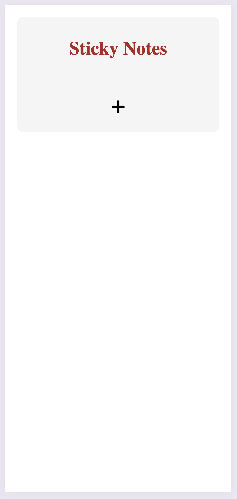
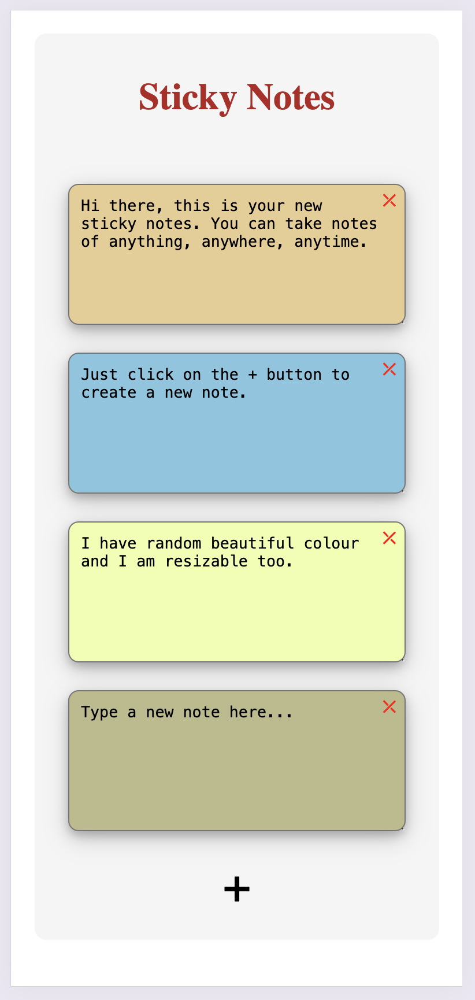
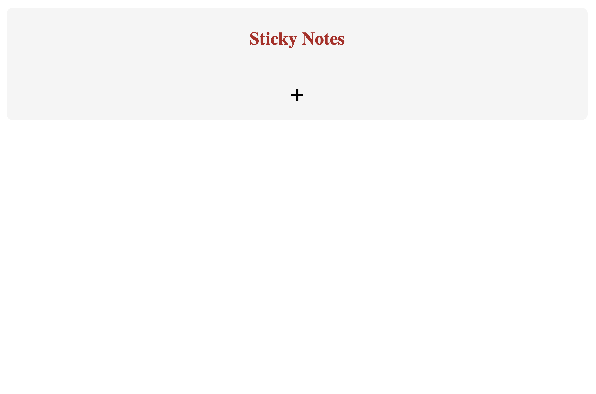
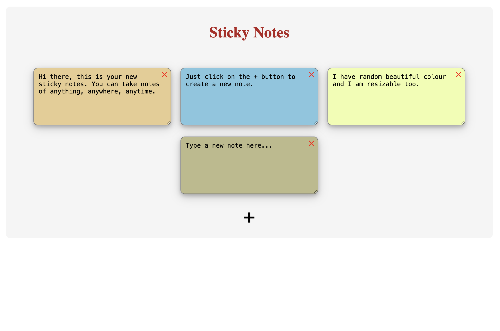

# Sticky Notes Project

## Overview
This project is a simple web application for creating and managing sticky notes on a dashboard. Users can add, edit, and delete notes dynamically using JavaScript.

### Key Features
1. Add Note: Click the "+" button to add a new sticky note.
2. Edit Note: Click on a note to edit its content.
3. Delete Note: Click the "X" button on a note to remove it.

## Screenshots

### mobile:
{height=450px}
{height=450px}

### web:
{height=450px}
{height=450px}

## Project Structure
1. index.html: The main HTML file that contains the structure of the web page.
2. style.css: The CSS file that styles the web page.
3. myscript.js: The JavaScript file that handles the dynamic creation and management of sticky notes.

## How to Run
1. Clone the repository.
2. Open index.html in a web browser.